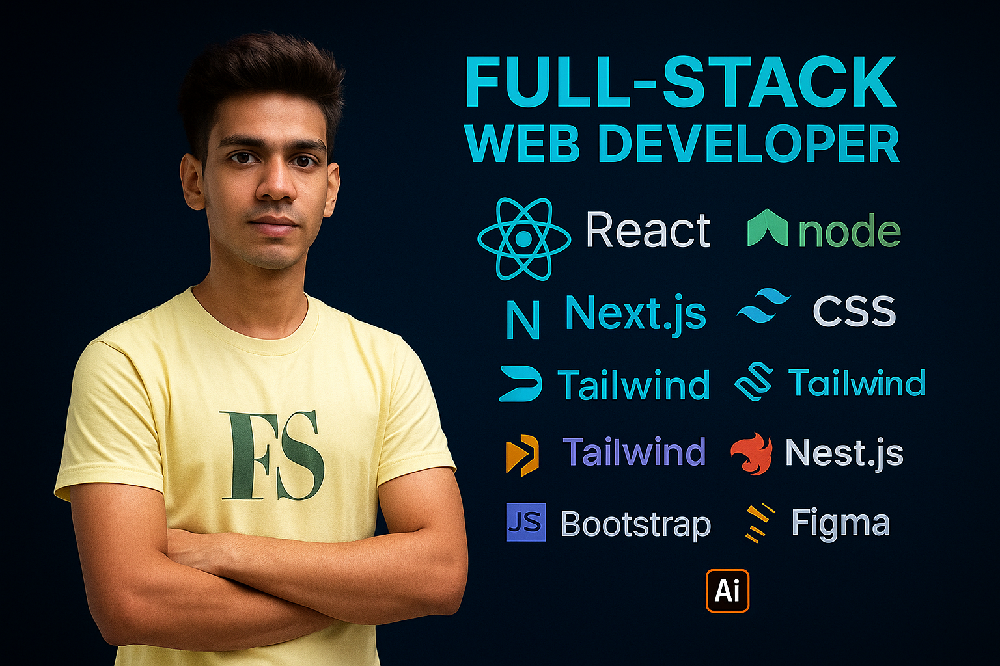
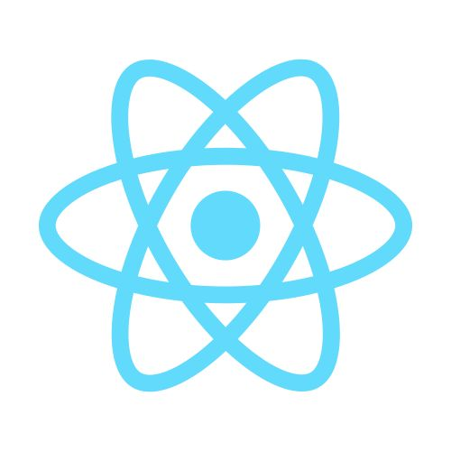
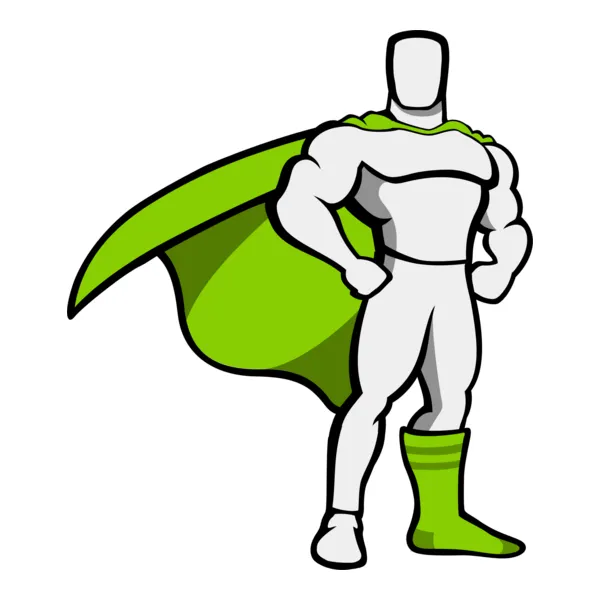

<h3> Skill, Languages and Tools :</h3>

  
  <b>&nbsp; React js ✅</b>

  
  <b>&nbsp; Node js ✅</b>

  
  <b>&nbsp; Express js ✅</b>

  
  <b>&nbsp; Mongo DB ✅</b>

  
  <b>&nbsp; JavaScript ✅</b>

  
  <b>&nbsp; HTML5 ✅</b>

  
  <b>&nbsp; CSS ✅</b>

  
  <b>&nbsp; Tailwind CSS ✅</b>

  
  <b>&nbsp; Bootstrap 5 ✅</b>

  
  <b>&nbsp; GSAP (Web Animation) ✅</b>

  
  <b>&nbsp; Figma ✅</b>

<h3>Connect with me:</h3>

&nbsp;
